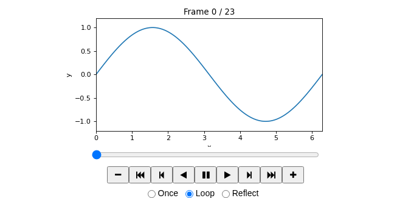
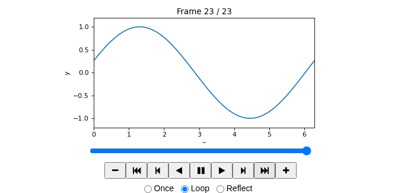

# FuncAnimationを実行して再生する

`matplotlib.animation.FuncAnimation` を使い、正弦波の位相を少しずつ変えます。
**Run ▶** を押すとPythonが24枚のフレームを生成し、コードの直下にプレイヤーを表示します。
生成には数秒かかります。表示後はプレイヤーの **Play（▶）** で再生してください。

## 動く正弦波

$$
y(x,t)=\sin(x-t)
$$

`update` が各フレームの波形とタイトルを更新します。
`interval` は再生間隔（ミリ秒）、`frames` はフレーム数です。

```{python-interactive}
import numpy as np
import matplotlib.pyplot as plt
from matplotlib import animation
from IPython.display import HTML, display

x = np.linspace(0, 2 * np.pi, 120)
fig, ax = plt.subplots(figsize=(6, 3), dpi=80)
line, = ax.plot(x, np.sin(x))
ax.set(xlim=(0, 2 * np.pi), ylim=(-1.2, 1.2), xlabel="x", ylabel="y")
title = ax.set_title("Frame 0 / 23")

def update(frame):
    phase = 2 * np.pi * frame / 24
    line.set_ydata(np.sin(x - phase))
    title.set_text(f"Frame {frame} / 23")
    return line, title

ani = animation.FuncAnimation(fig, update, frames=24, interval=80, blit=False)
plt.close(fig)
display(HTML(ani.to_jshtml(default_mode="loop")))
```

## アニメーションであることを確かめる

1. **Play（▶）** を押すと波形・図の `Frame` 番号・スライダーが変わります。
2. **Pause（⏸）** で停止し、スライダーを動かすと任意のフレームを表示できます。
3. **First frame** と **Last frame** で最初と最後の波形を比較できます。
4. `interval=160` に編集してRunを押すと、ゆっくり再生するプレイヤーを作り直します。
5. **Reset** でプレイヤーを消去し、元のコードに戻せます。

`plt.show()` だけではこの実行環境の出力は静止画になります。
[公式FuncAnimation](https://matplotlib.org/stable/api/_as_gen/matplotlib.animation.FuncAnimation.html)で作成したアニメーションを
`to_jshtml()` と `display(HTML(...))` で表示することで、ブラウザ内のプレイヤーで再生できます。
FFmpegやサーバーでの動画変換は不要です。

フレームを増やすと生成時間・メモリ・出力サイズが増えます。まずは24枚程度で試してください。
プレイヤーは記事とは別のsandbox内で実行され、表示内容に合わせて高さを調整します。
[静止画のMatplotlib例](matplotlib-interactive.md) と [NumPy計算](numpy-interactive.md) も試せます。

## ブラウザでの実行確認

以下は、このコードを実際にブラウザ上で実行して取得したスクリーンショットです。
最初と最後で波形とフレーム番号が変わっています。再生中にフレーム番号が進むことと、Pauseで止まることも確認しています。
上のコードのRun、プレイヤーのPlayで、ご自身でも再生を確認できます。

**最初のフレーム（0 / 23）**



**最後のフレーム（23 / 23）**


